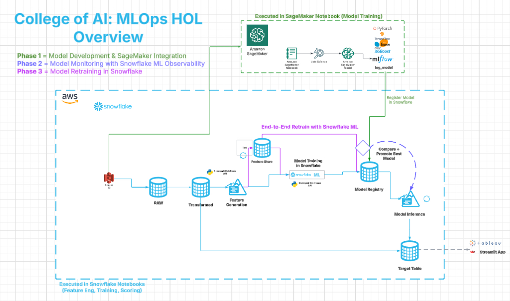

**Migrate, Monitor, and Retrain SageMaker Models in Snowflake**

# Lab Overview
In this hands-on lab, you'll take an XGBoost model trained in SageMaker and bring it into Snowflake. You'll use the Model Registry for governance, run batch inference via SQL, track model health with ML Observability, and perform retraining and promotion with warehouse compute.

## Lab Workflow
- **Phase 1: [Model Development & SageMaker Integration](lab_instructions/phase1_setup.md)**
  - Train and evaluate an XGBoost model in SageMaker
  - Log the model into [Snowflake Model Registry](https://docs.snowflake.com/en/developer-guide/snowflake-ml/model-registry/overview) 
  - Perform batch-scoring on historical mortgage data stored in Snowflake (Weeks 1–5)

- **Phase 2: [Model Monitoring with Snowflake ML Observability](lab_instructions/phase2_observability.md)**
  - Configure [Snowflake ML Observability](https://docs.snowflake.com/en/developer-guide/snowflake-ml/model-registry/model-observability) to baseline, monitor performance, and detect drift
  - Configure [Snowflake Alerts](https://docs.snowflake.com/en/guides-overview-alerts) to send email notification for performance degradation
  - Generate custom performance reports and visualizations

- **Phase 3: [End-to-End Model Retraining in Snowflake ML](lab_instructions/phase3_retraining.md)**
  - Preprocess updated training data using [Snowpark ML](https://docs.snowflake.com/en/developer-guide/snowpark-ml/index) (e.g. OneHotEncoder)
  - Register features and entities in the [Snowflake Feature Store](https://docs.snowflake.com/en/developer-guide/snowflake-ml/feature-store/overview)
  - Train a new binary classification model natively in Snowflake
  - Log the new model version to the [Snowflake Model Registry](https://docs.snowflake.com/en/developer-guide/snowflake-ml/model-registry/overview)
  - Use [Snowflake ML Explainability](https://docs.snowflake.com/en/developer-guide/snowflake-ml/model-registry/model-explainability) to interpret the model
  - Monitor drift with [Snowflake ML Observability](https://docs.snowflake.com/en/developer-guide/snowflake-ml/model-registry/model-observability) between V1 and V2
  - Promote V2 to production using [model version aliases](https://docs.snowflake.com/en/developer-guide/snowflake-ml/model-registry/overview#model-version-aliases)
  - Run version-agnostic batch scoring or [inference in Snowflake warehouses](https://docs.snowflake.com/en/developer-guide/snowflake-ml/model-registry/warehouse) using the [PRODUCTION alias](https://docs.snowflake.com/en/developer-guide/snowflake-ml/model-registry/overview#model-version-aliases)

## Prerequisites
**Snowflake Environment:**
- Account with ACCOUNTADMIN privileges to create:
  - Databases, schemas, warehouses, and stages
  - Service user (mlops_user) with key-pair authentication
  - Email notification integration
  - [See detailed setup instructions](lab_instructions/phase1_setup.md)
    
**AWS SageMaker:**
- Access to SE-Sandbox or equivalent environment
- JupyterLab space with SageMaker Distribution 2.4.2
- **Important:** Always STOP your JupyterLab space when not actively working and DELETE it after completing the lab
- [See detailed setup instructions](lab_instructions/phase1_setup.md)

**Required Files**
- **Data Files:**
  - [Mortgage_Data.csv](https://github.com/sfc-gh-DShaw98/SageMaker-to-Snowflake-Batch-Inference-Lab/blob/main/data/Mortgage_Data.csv) (for initial model training)
  - [NewTrainingData.csv](https://github.com/sfc-gh-DShaw98/SageMaker-to-Snowflake-Batch-Inference-Lab/blob/main/data/NewTrainingData.csv) (for model retraining)
    
**Configuration Files:**
  - [connections.toml](https://github.com/sfc-gh-DShaw98/SageMaker-to-Snowflake-Batch-Inference-Lab/blob/main/config/connections.toml) (Snowflake connection config)
  - rsa_private_key.pem (for secure authentication)
  - [College-of-AI-MLOPsExerciseNotebook.ipynb](https://github.com/sfc-gh-DShaw98/SageMaker-to-Snowflake-Batch-Inference-Lab/blob/main/notebooks/College-of-AI-MLOPsExerciseNotebook.ipynb) (SageMaker notebook)
  - [MLOPs Snowflake ML Observability In Action Exercise.ipynb](https://github.com/sfc-gh-DShaw98/SageMaker-to-Snowflake-Batch-Inference-Lab/blob/main/notebooks/MLOPs%20Snowflake%20ML%20Observability%20In%20Action%20Exercise.ipynb) (Snowflake notebook)
  - [MLOPs End-to-End Snowflake ML Retraining Exercise.ipynb](https://github.com/sfc-gh-DShaw98/SageMaker-to-Snowflake-Batch-Inference-Lab/blob/main/notebooks/MLOPs%20End-to-End%20Snowflake%20ML%20Retraining%20Exercise.ipynb) (Snowflake notebook)

**Notebook Environments**
- **Phase 1:** AWS SageMaker JupyterLab with Python 3.8+
- **Phase 2:** Snowflake Notebooks with Warehouse Runtime
- **Phase 3:** Snowflake Notebooks with Container Runtime (Snowflake ML Runtime CPU 1.0)

## Lab Completion Requirements

To receive credit for completing this HOL, you must successfully complete all DORA evaluations:
- SEAI50: Confirms SageMaker model registration in Snowflake
- SEAI51: Confirms batch inference completion
- SEAI52: Verifies ML Observability setup
- SEAI53: Confirms Model Version V2 registration
- SEAI54: Verifies PRODUCTION alias assignment to V2

  
## Helpful Resources
- [Snowflake Model Registry Documentation](https://docs.snowflake.com/en/developer-guide/snowflake-ml/model-registry/overview)
- [Snowflake ML Observability Documentation](https://docs.snowflake.com/en/developer-guide/snowflake-ml/model-registry/model-observability)
- [Inference in Snowflake Warehouses Documentation](https://docs.snowflake.com/en/developer-guide/snowflake-ml/model-registry/inference)
- [Snowpark ML Documentation](https://docs.snowflake.com/en/developer-guide/snowpark-ml/index)
- [Snowflake Feature Store Documentation](https://docs.snowflake.com/en/developer-guide/snowflake-ml/feature-store/overview)
- [Snowflake ML Explainability Documentation](https://docs.snowflake.com/en/developer-guide/snowflake-ml/explainability)

Created by: SE Enablement (Diana Shaw) | Last Updated: June 18, 2025
